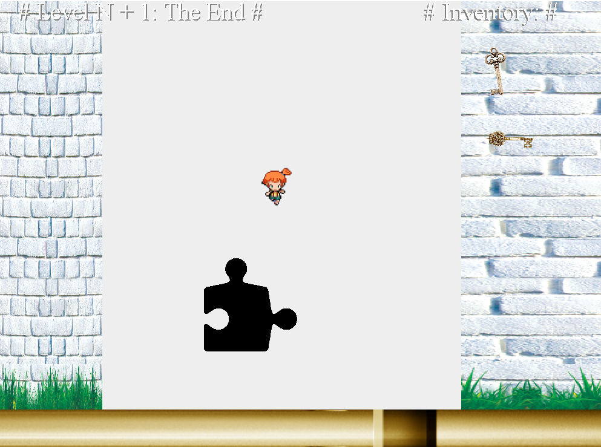
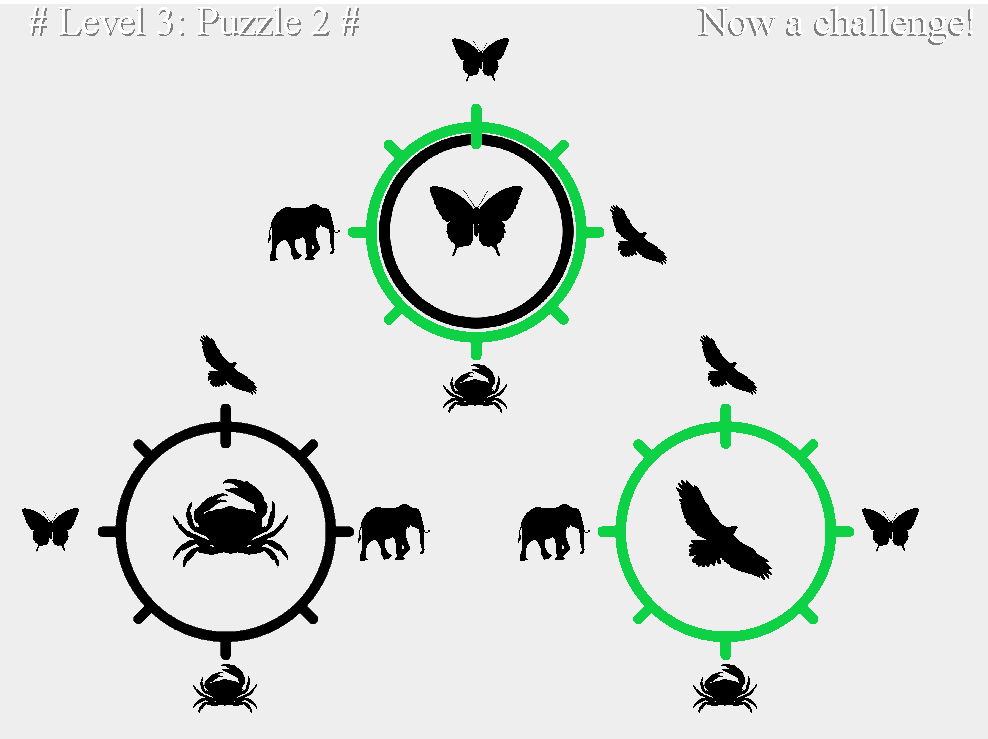

# CMSC 209 - Computers for Learning

Coursework for the University of Chicago.

Over time, technology has occupied an increasing role in education, with mixed results. Massive Open Online Courses (MOOCs) were created to bring education to those without access to universities, yet most of the students who succeed in them are those who are already successful in the current educational model. This course covers technology, psychology (e.g., motivation, engagement), and pedagogy (e.g., constructivism) as they apply to educational technology so that students can design and build an educational learning application. Labs focus on developing expertise in technology, and readings supplement lecture discussions on the human components of education.

## Demo:

## Full Game:

## Minigame:

